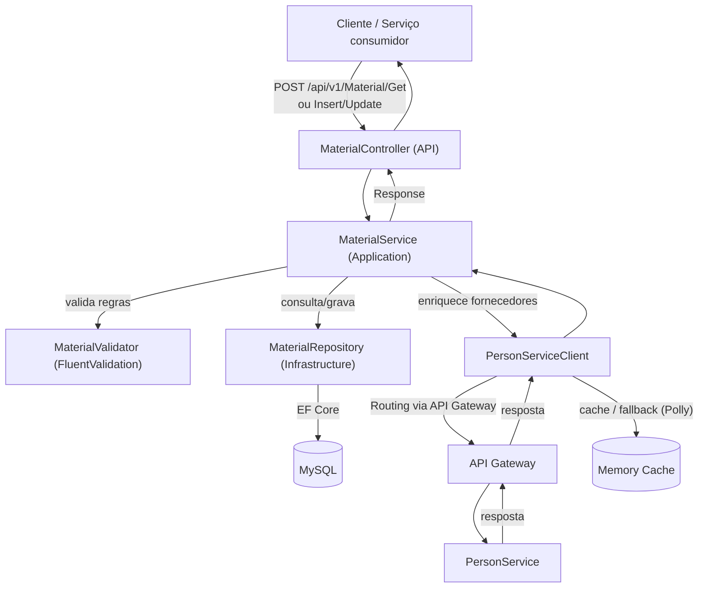
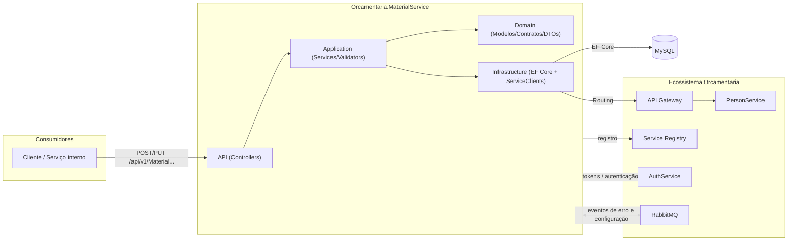
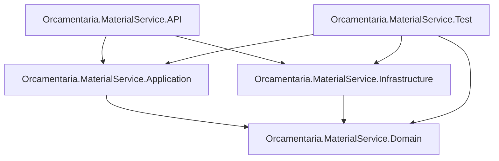

# 🧱 Orcamentaria.MaterialService

Microsserviço do ecossistema **Orcamentaria** responsável pelo domínio de **Materiais**: cadastro de materiais, tipos de material e a associação de materiais a fornecedores (representados como pessoas no `Orcamentaria.PersonService`).

---

## 🎯 Objetivo

O `Orcamentaria.MaterialService` centraliza o gerenciamento de materiais utilizados no ecossistema Orcamentaria:

1. Mantém o cadastro de **Materiais** (`Material`), com nome, descrição, fabricante e um tipo associado;
2. Mantém o cadastro de **Tipos de Material** (`MaterialType`), usados para classificar os materiais;
3. Permite associar e desassociar **fornecedores** (`MaterialSupplier`) a um material, respeitando um limite máximo de 5 fornecedores por material;
4. Enriquece a listagem de materiais com os dados dos fornecedores, obtidos em tempo real do `PersonService` através do API Gateway, com cache e fallback em caso de indisponibilidade.

Todas as entidades são multi-tenant (segregadas por `CompanyId`), seguindo o padrão do ecossistema.

---

## 🧰 Tecnologias

| Tecnologia | Versão | Finalidade |
|---|---|---|
| C# / .NET | 9 (`net9.0`) | Linguagem e runtime da aplicação |
| ASP.NET Core Web API | `Microsoft.NET.Sdk.Web` | Hospedagem HTTP |
| Entity Framework Core | 9.0.11 | ORM de acesso a dados |
| MySql.EntityFrameworkCore | 9.0.9 | Provider EF Core para MySQL |
| AutoMapper | 15.1.0 | Mapeamento entre entidades e DTOs |
| FluentValidation | 12.0.1 / 12.1.0 | Validação de regras de negócio |
| Polly / Polly.Core / Polly.Extensions | 8.6.4 | Resiliência (circuit breaker e fallback) nas chamadas ao `PersonService` |
| `Orcamentaria.Lib.Domain` | 10.1.1 | Modelos, enums, exceptions e contratos compartilhados do ecossistema |
| `Orcamentaria.Lib.Application` | 2.1.4 | Implementações compartilhadas de HTTP client, Service Registry e cache |
| `Orcamentaria.Lib.Infrastructure` | 5.4.0 | Composição de serviços e middlewares comuns a todos os serviços do ecossistema |
| `Orcamentaria.Lib.Test` | 1.1.2 | Utilitários de teste compartilhados (ex.: `Orcamentaria.Lib.Test.Repositories`) |
| xUnit / Moq / Moq.AutoMock / FluentAssertions / Bogus | — | Stack de testes unitários (`Orcamentaria.MaterialService.Test`) |
| Microsoft.EntityFrameworkCore.InMemory | 9.0.11 | Banco em memória usado nos testes de repositório |
| coverlet.collector | — | Coleta de cobertura de testes |

---

## 🏗️ Arquitetura

O projeto segue uma **arquitetura em camadas**, apoiada na biblioteca interna compartilhada `Orcamentaria.Lib`, que concentra a infraestrutura transversal do ecossistema (autenticação, Swagger, CORS, mensageria, HTTP client, cache, registro no Service Registry).

- **Domain**: modelos (`Material`, `MaterialType`, `MaterialSupplier`), DTOs, mapeadores AutoMapper, contratos de repositórios/serviços/validadores/service clients — sem dependência de frameworks web ou de EF Core.
- **Application**: implementação das regras de negócio (`MaterialService`, `MaterialTypeService`, `MaterialSupplierService`), validadores FluentValidation e o serviço de resiliência (`PersonResilienceService`) usado nas chamadas ao `PersonService`.
- **Infrastructure**: `MySqlContext` (EF Core), `IEntityTypeConfiguration` de cada entidade, repositórios concretos (`MaterialRepository`, `MaterialTypeRepository`, `MaterialSupplierRepository`, todos herdando de `BaseRepository<TEntity>` da `Orcamentaria.Lib.Infrastructure`) e o `PersonServiceClient`, que consome o `PersonService` via API Gateway.
- **API**: Controllers (`MaterialController`, `MaterialTypeController`), composição de injeção de dependência (`Startup.cs`) e chaves públicas RSA para validação de token (`Keys/public_key_user.pem`, `Keys/public_key_service.pem`).

Fluxo de dependência entre camadas: `API → Application/Infrastructure → Domain`, sempre apontando para dentro.

---

## 📁 Estrutura do Projeto

```text
Orcamentaria.MaterialService/
├── Orcamentaria.MaterialService.API/              # Apresentação HTTP (composition root)
│   ├── Controllers/v1/MaterialController.cs       #   Endpoints de Material
│   ├── Controllers/v1/MaterialTypeController.cs   #   Endpoints de MaterialType
│   ├── Keys/                                      #   Chaves públicas RSA para validação de token
│   ├── Program.cs / Startup.cs                    #   Bootstrap e injeção de dependências
│   └── appsettings*.json                          #   Configuração da aplicação
├── Orcamentaria.MaterialService.Application/      # Regras de negócio
│   ├── Services/MaterialService.cs                #   CRUD de material + orquestração de fornecedores
│   ├── Services/MaterialTypeService.cs            #   CRUD de tipo de material
│   ├── Services/MaterialSupplierService.cs        #   Consulta de vínculos material/fornecedor
│   ├── Services/PersonResilienceService.cs        #   Predicado e fallback de resiliência (Polly) para o PersonService
│   └── Validators/MaterialValidator.cs, MaterialTypeValidator.cs
├── Orcamentaria.MaterialService.Domain/           # Modelos, contratos e DTOs
│   ├── Models/Material.cs, MaterialType.cs, MaterialSupplier.cs
│   ├── DTOs/Material/*.cs, DTOs/MaterialType/*.cs, DTOs/Person/PersonResponseDTO.cs
│   ├── Mappers/MaterialMapper.cs, MaterialTypeMapper.cs
│   ├── Repositories/IMaterialRepository.cs, IMaterialTypeRepository.cs, IMaterialSupplierRepository.cs
│   ├── Services/IMaterialService.cs, IMaterialTypeService.cs, IMaterialSupplierService.cs
│   ├── ServiceClient/IPersonServiceClient.cs
│   └── Validators/IMaterialValidator.cs
├── Orcamentaria.MaterialService.Infrastructure/   # Acesso a dados e integrações externas
│   ├── Contexts/MySqlContext.cs                   #   DbContext (Materials, MaterialTypes, MaterialSuppliers)
│   ├── Configurations/*.cs                        #   Mapeamento EF Core (Fluent API) de cada entidade
│   ├── Repositories/*.cs                          #   Implementações concretas dos repositórios
│   └── ServiceClients/PersonServiceClient.cs       #   Cliente HTTP (via API Gateway) para o PersonService
├── Orcamentaria.MaterialService.Test/              # Testes unitários (xUnit + Moq.AutoMock + FluentAssertions)
│   ├── Contexts/MySqlContextTest.cs
│   ├── Fixtures/MaterialFixture.cs, MaterialTypeFixture.cs, MaterialSupplierFixture.cs
│   ├── Repositories/*.cs
│   ├── Services/*.cs
│   ├── ServiceClients/PersonServiceClientTest.cs
│   └── Validators/*.cs
├── Dockerfile
├── compose.yaml
└── Orcamentaria.MaterialService.sln
```

---

## 🔄 Fluxo da Aplicação



**Passo a passo (exemplo: `GET` de materiais):**
1. O cliente envia `GridParams` (paginação/filtros) para `POST /api/v1/Material/Get`.
2. `MaterialController` delega para `MaterialService.GetAsync`.
3. `MaterialRepository` consulta o `MySqlContext`, retornando os materiais (com `Type` e `Suppliers` incluídos) já filtrados pelo `CompanyId` do tenant autenticado.
4. `MaterialService` extrai os `SupplierId` de todos os materiais retornados e chama `IPersonServiceClient.GetSuppliersAsync`.
5. `PersonServiceClient` obtém um token de serviço (`ITokenProvider`) e roteia a chamada via `IApiGetawayService` para o serviço `PersonService`, endpoint `PersonGetForService`.
6. Em caso de indisponibilidade do `PersonService`, o pipeline Polly (`PersonResilienceService`) aciona um fallback que retorna os dados de fornecedores previamente armazenados em cache de memória.
7. Os dados de fornecedores são combinados com os materiais via AutoMapper e retornados como `Response<IEnumerable<MaterialResponseDTO>>`.

---

## 📦 Dependências principais

| Biblioteca | Uso no projeto |
|---|---|
| `Orcamentaria.Lib.Domain` | Modelos compartilhados: `TenantEntity`, `GridParams`/`FilterParam`, `Response<T>`, `ResponsePagination`, `ErrorCodeEnum`, exceptions de domínio (`InfoException`, `ValidationException`, `DatabaseException`, `UnexpectedException`), contexto de autenticação (`IUserAuthContext`). |
| `Orcamentaria.Lib.Application` | `IApiGetawayService` (roteamento de chamadas entre serviços), `IMemoryCacheService`, provedores de token. |
| `Orcamentaria.Lib.Infrastructure` | `ResolveCommonServicesWithMySql`/`ConfigureCommon`, `BaseRepository<TEntity>`, `AddServiceRegistryHosted` — usados em `Startup.cs` para compor a infraestrutura comum (autenticação JWT, Swagger, CORS, RabbitMQ, EF Core + MySQL, registro no Service Registry). |
| `AutoMapper` | Mapeamento entre `Material`/`MaterialType` e seus respectivos DTOs de entrada/saída. |
| `FluentValidation` | Regras de validação de `Material` e `MaterialType` antes de inserir/atualizar. |
| `Polly` | Predicados de resiliência e fallback (`PersonResilienceService`) para a chamada ao `PersonService`. |

---

## ⚙️ Configuração

A aplicação usa o modelo padrão de configuração do ASP.NET Core (`appsettings.json` + `appsettings.{Environment}.json` + variáveis de ambiente).

**`Orcamentaria.MaterialService.API/appsettings.json`** define:
- `Logging`: níveis de log padrão (`Default: Information`, `Microsoft.AspNetCore: Warning`);
- `ApiGetawayConfiguration.BaseUrl`: endereço do API Gateway usado pelo `PersonServiceClient` para rotear chamadas ao `PersonService`;
- `BOOTSTRAPSECRET`: segredo utilizado pelo mecanismo de bootstrap do ecossistema para obtenção de um token de serviço junto ao `AuthService` (o valor real não é reproduzido aqui).

**`Orcamentaria.MaterialService.API/appsettings.Development.json`**: contém overrides de `Logging` para o ambiente de desenvolvimento.

As demais configurações do serviço — `ServiceRegistryConfiguration` (registro/descoberta no Service Registry), `MessageBrokerConfiguration` (RabbitMQ), `ServiceConfiguration` (identificação do serviço) e a string de conexão com o banco de dados (`ConnectionStrings:DefaultConnection`) — não ficam nos arquivos `appsettings*.json` deste repositório: são buscadas em tempo de execução no `Orcamentaria.ConfigBagService`, que centraliza a configuração de todos os serviços do ecossistema. `ApiGetawayConfiguration.BaseUrl` e `BOOTSTRAPSECRET` são as exceções que permanecem locais, pois são justamente o que o serviço precisa para localizar o API Gateway e se autenticar antes de buscar o restante da sua configuração.

---

## 🔑 Variáveis de Ambiente

| Variável | Descrição |
|---|---|
| `ASPNETCORE_ENVIRONMENT` | Define o ambiente ASP.NET Core (default `Development` via `launchSettings.json`). |
| `ASPNETCORE_URLS` | URL(s) em que o Kestrel escuta (definida como `http://+:5000` no `compose.yaml`). |
| `ConnectionStrings__DefaultConnection` | String de conexão MySQL usada pelo `MySqlContext` (`Server`, `Port`, `Database`, `User`, `Password`), definida no `compose.yaml` ao subir o serviço em contêiner. |

---

## 🗄️ Banco de Dados

O serviço utiliza **MySQL**, acessado via **Entity Framework Core** (`Microsoft.EntityFrameworkCore` + `MySql.EntityFrameworkCore`), configurado por `MySqlContext` na camada Infrastructure.

**Tabelas mapeadas (via Fluent API, em `Configurations/`):**

| Tabela | Entidade | Principais colunas |
|---|---|---|
| `T_MATERIAL` | `Material` | `ID`, `NAME` (VARCHAR 60), `DESCRIPTION` (VARCHAR 256), `MANUFACTURER` (VARCHAR 150), `MATERIAL_TYPE_ID`, `ACTIVE` (BIT, default `true`), `COMPANY_ID`, `CREATED_AT`, `CREATED_BY`, `UPDATED_AT`, `UPDATED_BY` |
| `T_MATERIAL_TYPE` | `MaterialType` | `ID`, `NAME` (VARCHAR 40), `ACTIVE` (BIT, default `true`), `COMPANY_ID`, `CREATED_AT`, `CREATED_BY`, `UPDATED_AT`, `UPDATED_BY` |
| `T_MATERIAL_SUPPLIER` | `MaterialSupplier` | `ID`, `MATERIAL_ID`, `SUPPLIER_ID`, `COMPANY_ID` |

Relacionamentos: `Material` possui uma referência obrigatória a `MaterialType` (`fk_T_MATERIAL_T_MATERIAL_TYPE`, `DeleteBehavior.Restrict`) e uma coleção de `MaterialSupplier` (`fk_T_MATERIAL_T_MATERIAL_SUPPLIER`). `Material` e `MaterialType` herdam de `TenantEntity` (`Orcamentaria.Lib.Domain`), que adiciona `CompanyId`, `CreatedAt`, `CreatedBy`, `UpdatedAt` e `UpdatedBy` — todo o acesso a dados é segregado por `CompanyId` no `BaseRepository`/repositórios concretos.

O `compose.yaml` sobe um container `mysql:8.0` para uso local/desenvolvimento, com volume persistente (`mysql-data`) e diretório de scripts de inicialização (`./mysql-init-scripts`).

---

## ▶️ Como Executar

### Pré-requisitos
- [.NET SDK 9.0](https://dotnet.microsoft.com/download)
- MySQL acessível (local, remoto ou via `compose.yaml`)
- Service Registry, API Gateway e AuthService em execução e acessíveis, para autenticação e roteamento das chamadas ao `PersonService`

### Localmente

```bash
git clone <url-do-repositorio>
cd Orcamentaria.MaterialService

dotnet restore
dotnet build

dotnet run --project Orcamentaria.MaterialService.API
```

A API sobe, por padrão, em `https://localhost:53092` (perfil HTTP: `http://localhost:53093`), abrindo automaticamente o navegador em `/swagger`.

### Via Docker

O repositório inclui `Dockerfile` (build multi-stage com SDK/runtime .NET 8) e `compose.yaml`, que sobem o `MaterialService` junto de um banco `mysql:8.0`:

```bash
docker compose up --build
```

Isso inicia o container `mysql` (porta `4406` no host, mapeada para `3306`) e o container `MaterialService-container` (porta `5000`), com a connection string apontando para o container MySQL via variável de ambiente `ConnectionStrings__DefaultConnection`.

---

## 🧪 Como Rodar Testes

O projeto de testes (`Orcamentaria.MaterialService.Test`) usa **xUnit**, **Moq**/**Moq.AutoMock**, **FluentAssertions** e o pacote compartilhado **`Orcamentaria.Lib.Test`**.

```bash
dotnet test
```

Para gerar relatório de cobertura:

```bash
dotnet test --collect:"XPlat Code Coverage"
```

**Cobertura por classe testada:**

| Classe testada | Cenários cobertos |
|---|---|
| `MaterialRepository` | inserção e remoção de fornecedores (sucesso, material não encontrado, banco vazio) usando banco EF Core InMemory |
| `MaterialTypeRepository` / `MaterialSupplierRepository` | operações de consulta e persistência via `BaseRepository` |
| `MaterialService` | consulta por id, listagem paginada, inserção, atualização, adição/remoção de fornecedores |
| `MaterialTypeService` / `MaterialSupplierService` | consulta, inserção e atualização |
| `MaterialValidator` / `MaterialTypeValidator` | validação de regras de negócio (campos obrigatórios, tamanho máximo, unicidade de nome de tipo, validação de fornecedores) |
| `PersonServiceClient` | consulta de fornecedores via API Gateway, uso de cache |
| `PersonResilienceService` | predicado de resiliência e fallback (cache de fornecedores) |

---

## 🧭 APIs

### Swagger / OpenAPI
O Swagger está habilitado em ambiente de desenvolvimento, acessível em `/swagger`.

### Endpoints

| Método | Rota | Autorização (Roles) | Descrição |
|---|---|---|---|
| `POST` | `/api/v1/Material/Get` | `MASTER`, `MATERIAL:READ` | Lista materiais de forma paginada/filtrada (`GridParams`), incluindo tipo e fornecedores associados. |
| `POST` | `/api/v1/Material/Insert` | `MASTER`, `MATERIAL:INSERT` | Insere um novo material (`MaterialInsertDTO`). |
| `PUT` | `/api/v1/Material/Update/{id}` | `MASTER`, `MATERIAL:UPDATE` | Atualiza um material existente (`MaterialUpdateDTO`). |
| `PUT` | `/api/v1/Material/AddSuppliers/{id}` | `MASTER`, `MATERIAL:UPDATE` | Associa fornecedores a um material (`MaterialAddSuppliersDTO`), respeitando o limite de 5 fornecedores por material. |
| `PUT` | `/api/v1/Material/RemoveSuppliers/{id}` | `MASTER`, `MATERIAL:UPDATE` | Remove fornecedores de um material (`MaterialRemoveSuppliersDTO`). |
| `POST` | `/api/v1/MaterialType/Get` | `MASTER`, `MATERIAL:READ` | Lista tipos de material de forma paginada/filtrada. |
| `POST` | `/api/v1/MaterialType/Insert` | `MASTER`, `MATERIAL:INSERT` | Insere um novo tipo de material (`MaterialTypeInsertDTO`). |
| `PUT` | `/api/v1/MaterialType/Update/{id}` | `MASTER`, `MATERIAL:UPDATE` | Atualiza um tipo de material existente (`MaterialTypeUpdateDTO`). |

---

## 🔗 Integrações

| Integração | Descrição |
|---|---|
| **Service Registry** | O serviço se registra automaticamente ao subir (`AddServiceRegistryHosted`), permitindo descoberta pelo API Gateway. |
| **API Gateway** | `PersonServiceClient` roteia chamadas ao `PersonService` através do Gateway (`ApiGetawayConfiguration.BaseUrl`), em vez de chamar o serviço diretamente. |
| **PersonService** | Fonte dos dados de fornecedores (`PersonGetForService`), usados para enriquecer os materiais retornados com nome/documento de cada fornecedor. |
| **AuthService** | Origem dos tokens de serviço/bootstrap validados pela infraestrutura de autenticação compartilhada. |
| **MySQL** | Persistência de `Material`, `MaterialType` e `MaterialSupplier` via EF Core. |
| **RabbitMQ** | Consumido pela infraestrutura compartilhada (`Orcamentaria.Lib.Infrastructure`) para publicação de eventos de erro e recebimento de atualizações de configuração em tempo real. |

---

## 📈 Logs

Logging via `Microsoft.Extensions.Logging`, configurado em `appsettings.json`:

```json
"Logging": {
  "LogLevel": {
    "Default": "Information",
    "Microsoft.AspNetCore": "Warning"
  }
}
```

---

## 🚨 Tratamento de Erros

As camadas de serviço tratam exceptions de negócio conhecidas (`DefaultException` e derivadas, como `InfoException`, `ValidationException`, `DatabaseException`) propagando-as sem alteração, e envolvem falhas inesperadas em `UnexpectedException`. O middleware compartilhado da infraestrutura (`ErrorHandlingMiddleware`, `AuthMiddleware`, `RequestMiddleware`, registrados em `ConfigureCommon`) formata as respostas de erro e trata autenticação/autorização e correlação de requisições de forma centralizada para todos os serviços do ecossistema.

---

## 🔐 Segurança

O serviço participa da infraestrutura de autenticação do ecossistema baseada em **JWT (RS256)**, com múltiplos esquemas (`userJwt`, `serviceJwt`, `bootstrapJwt`) selecionados dinamicamente conforme o token recebido, validados com chaves públicas RSA embarcadas (`Keys/public_key_user.pem`, `Keys/public_key_service.pem`).

Os endpoints de `Material` e `MaterialType` exigem autenticação e autorização por papéis (`[Authorize(Roles = ...)]`), com granularidade por operação: `MATERIAL:READ`, `MATERIAL:INSERT` e `MATERIAL:UPDATE`, além do papel `MASTER` com acesso irrestrito. Todas as consultas e persistências são segregadas por `CompanyId` do tenant autenticado (via `IUserAuthContext`).

---

## 🧩 Padrões Encontrados

| Padrão | Onde aparece |
|---|---|
| **Dependency Injection** | Serviços, repositórios e validadores registrados via `IServiceCollection` e injetados por construtor. |
| **Repository** | `IMaterialRepository`, `IMaterialTypeRepository`, `IMaterialSupplierRepository`, implementados sobre `BaseRepository<TEntity>`. |
| **DTO** | DTOs de entrada/saída dedicados por operação (`MaterialInsertDTO`, `MaterialUpdateDTO`, `MaterialResponseDTO`, `MaterialAddSuppliersDTO`, `MaterialRemoveSuppliersDTO`). |
| **Mapper (AutoMapper Profile)** | `MaterialMapper`, `MaterialTypeMapper` centralizam a conversão entre entidades e DTOs. |
| **Fluent Validation** | `MaterialValidator`, `MaterialTypeValidator` encapsulam regras de negócio reutilizáveis (`CommonValidation`, `ValidateBeforeInsert`, `ValidateBeforeUpdate`). |
| **Circuit Breaker / Fallback (Polly)** | `PersonResilienceService` define quando acionar o fallback e como reconstituir a resposta a partir do cache. |
| **Options Pattern** | Configuração fortemente tipada via `IOptions<ApiGetawayConfiguration>`. |
| **Interface Segregation** | Contratos definidos em Domain, implementados em Application/Infrastructure. |

---

## 📊 Diagrama de Arquitetura



---

## 🧱 Dependências entre Módulos



---

## 📝 Resumo Executivo

O **Orcamentaria.MaterialService** é o microsserviço do ecossistema Orcamentaria responsável pelo domínio de **Materiais**, oferecendo CRUD de materiais e tipos de material, além da gestão de fornecedores associados a cada material (limitado a 5 por material). Construído em .NET 9 com ASP.NET Core Web API e persistência em **MySQL** via Entity Framework Core, o serviço segue uma arquitetura em camadas (`API → Application/Infrastructure → Domain`) apoiada na biblioteca compartilhada `Orcamentaria.Lib`, que fornece autenticação JWT multi-esquema, Swagger, CORS, registro no Service Registry e integração com RabbitMQ.

Para enriquecer os materiais com dados de fornecedores, o serviço consome o `PersonService` através do **API Gateway**, com uma camada de resiliência baseada em **Polly** (circuit breaker e fallback em cache de memória) para tolerar indisponibilidades temporárias. O projeto conta com testes unitários (xUnit, Moq.AutoMock, FluentAssertions) cobrindo repositórios, serviços de aplicação, validadores e o cliente de integração com o `PersonService`.
